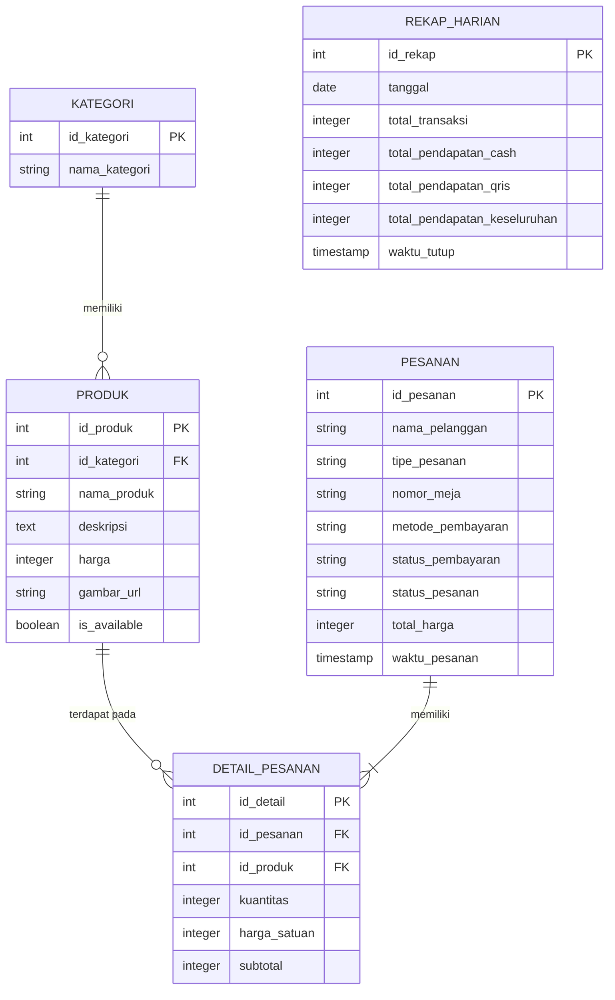

# Project Overview & PRD
## Sistem POS Kiosk Self-Ordering - Kedai Matcha & Coffee

---

## 1. Project Overview
**Nama Proyek:** Matcha & Coffee Kiosk POS System  
**Tipe Aplikasi:** Web Application (Optimasi Tablet untuk Kiosk & Dashboard Desktop untuk Admin)  

**Ringkasan Eksekutif:**  
Proyek ini bertujuan untuk membangun sistem Point of Sale (POS) berbasis *Self-Ordering Kiosk* yang ringan, efisien, dan fokus pada kecepatan transaksi. Mengeliminasi kompleksitas sistem POS tradisional, sistem ini dirancang spesifik untuk dikelola oleh *single admin* (pemilik) dengan antarmuka pelanggan langsung (tablet) di konter. 

Pada pembaruan ini, ditambahkan fitur **Close Order / Rekap Harian** yang memungkinkan admin melakukan "tutup buku" di akhir hari untuk merangkum dan menyimpan laporan pendapatan secara otomatis.

### 1.1. Tujuan Proyek
* Menyediakan antarmuka pemesanan mandiri yang intuitif bagi pelanggan untuk mengurangi antrean di kasir.
* Memberikan dashboard terpusat bagi pemilik (admin tunggal) untuk mengelola katalog menu, memantau status pesanan, dan melakukan rekapitulasi harian (*close order*).
* Menyimpan rekam jejak pesanan dan transaksi harian secara rapi dengan struktur data yang minimalis.

c Ruang Lingkup & Batasan (Scope & Out of Scope)
**In-Scope (Termasuk):**
* Katalog Menu (Kategori & Produk)
* Sistem Keranjang & Checkout (Self-Service)
* Input Nama Pelanggan & Opsi Dine-in/Takeaway
* Single Admin Role Dashboard
* Manajemen Status Pesanan (New, Preparing, Done)
* **[NEW] Fitur Close Order (Tutup Buku) & Rekapitulasi Penjualan Harian**

**Out-of-Scope (Tidak Termasuk):**
* Add-ons / Modifiers Minuman
* Sistem Diskon / Promo
* Sistem Inventaris / Pemotongan Stok Bahan Baku
* Multi-user Roles (Kasir, Barista) & Shift Kerja
* Manajemen Data Pelanggan / Membership / Poin

### 1.2. Tech Stack & Arsitektur
Sistem ini dibangun menggunakan arsitektur *Cloud-Based* dengan orientasi *separation of concerns* (SoC) yang kuat antara antarmuka dan basis data. Biaya operasional ditargetkan Rp 0 menggunakan *Free Tier*.

* **Frontend Framework:** Next.js (React)
* **Styling:** Tailwind CSS (Fokus pada antarmuka *flat design*, menghindari estetika AI generik)
* **Backend, Database & Auth:** Supabase (PostgreSQL)
* **Hosting & Deployment:** Vercel

---

## 2. Product Requirements Document (PRD)

### 2.1. Alur Pengguna (User Flow)

**A. Alur Pelanggan (Customer / Kiosk Flow):**
1. Pelanggan melihat layar *Home* pada tablet, menekan tombol "Mulai Pesan".
2. Sistem menampilkan daftar produk berdasarkan Kategori (Matcha, Coffee, dll).
3. Pelanggan menekan produk yang diinginkan untuk dimasukkan ke keranjang (bisa mengatur kuantitas + / -).
4. Pelanggan membuka keranjang dan menekan "Checkout".
5. Pelanggan mengisi form singkat: **Nama**, **Tipe Pesanan** (Dine-in/Takeaway), **Nomor Meja** (jika Dine-in), dan memilih **Metode Pembayaran** (Cash/QRIS).
6. Sistem menampilkan rangkuman pesanan dan nomor antrean/struk digital. Pesanan terkirim ke Admin.

**B. Alur Pemilik (Admin / Dashboard Flow):**
1. Admin login ke sistem (Single authentication).
2. Melihat daftar pesanan masuk secara *real-time* di halaman "Order Queue".
3. Mengubah status pesanan: `New` -> `Preparing` -> `Done` (serta menandai status pembayaran `Paid`).
4. Mengelola katalog produk (Tambah, Edit, Hapus, dan *Toggle Available/Sold Out*).
5. **[NEW]** Pada akhir jam operasional, Admin masuk ke menu "Laporan / Close Order".
6. **[NEW]** Admin menekan tombol "Tutup Buku Hari Ini". Sistem otomatis menghitung total pesanan, pendapatan Cash, dan pendapatan QRIS hari tersebut, lalu menyimpannya sebagai riwayat laporan harian.

### 2.2. Fitur Fungsional Utama

| Modul | Deskripsi Fitur |
| :--- | :--- |
| **Menu Catalog** | Menampilkan daftar produk dengan foto, harga, dan deskripsi. Data di-load berdasarkan Kategori. Produk dengan status `is_available = false` akan disembunyikan atau ditampilkan *grayed out* (Sold Out). |
| **Shopping Cart** | Menyimpan sementara pesanan sebelum checkout. Menghitung otomatis total harga berdasarkan kuantitas x harga satuan. |
| **Order Checkout** | Formulir akhir untuk pelanggan menginput Nama, memilih Dine-in/Takeaway (termasuk input No Meja), dan memilih Metode Pembayaran (Cash/QRIS). |
| **Order Management** | Papan Kanban / List sederhana untuk Admin memindahkan pesanan dari antrean baru, sedang dibuat, hingga selesai. Termasuk fitur menandai pembayaran lunas (jika bayar Cash). |
| **Product Management** | Halaman CRUD (Create, Read, Update, Delete) untuk mengatur Kategori dan Produk. |
| **[NEW] Close Order & Recap**| Halaman rekap yang mengalkulasi total pendapatan per metode pembayaran (Cash & QRIS) dalam satu hari. Data rekap akan dikunci dan disimpan saat Admin melakukan "Close Order" agar riwayat penjualan harian terekam rapi. |

---

## 3. Spesifikasi Data (ERD Reference)

Dengan adanya penambahan fitur **Close Order / Rekap Harian**, kita menambahkan 1 tabel baru yaitu `Rekap_Harian`. Tabel ini berfungsi untuk menyimpan rangkuman data saat operasional kedai ditutup (Tutup Buku).

### Daftar Tabel Utama:
1. **Kategori:** `id_kategori`, `nama_kategori`
2. **Produk:** `id_produk`, `id_kategori`, `nama_produk`, `deskripsi`, `harga`, `gambar_url`, `is_available`
3. **Pesanan:** `id_pesanan`, `nama_pelanggan`, `tipe_pesanan`, `nomor_meja`, `metode_pembayaran`, `status_pembayaran`, `status_pesanan`, `total_harga`, `waktu_pesanan`
4. **Detail_Pesanan:** `id_detail`, `id_pesanan`, `id_produk`, `kuantitas`, `harga_satuan`, `subtotal`
5. **[NEW] Rekap_Harian:** `id_rekap`, `tanggal`, `total_transaksi`, `total_pendapatan_cash`, `total_pendapatan_qris`, `total_pendapatan_keseluruhan`, `waktu_tutup`

### Mermaid ERD Diagram

